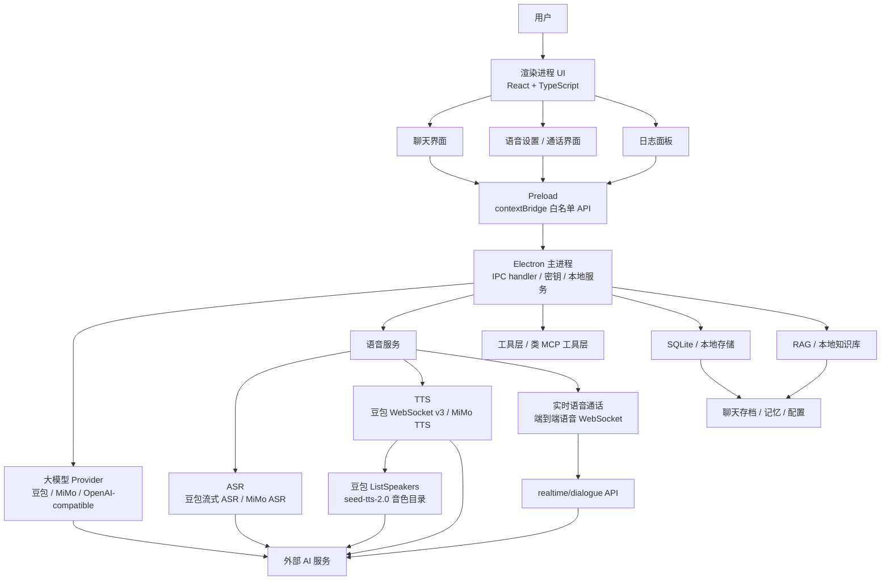
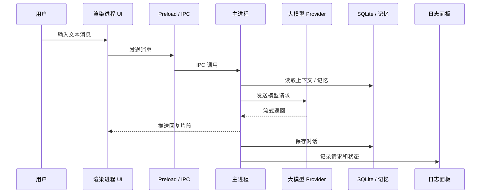
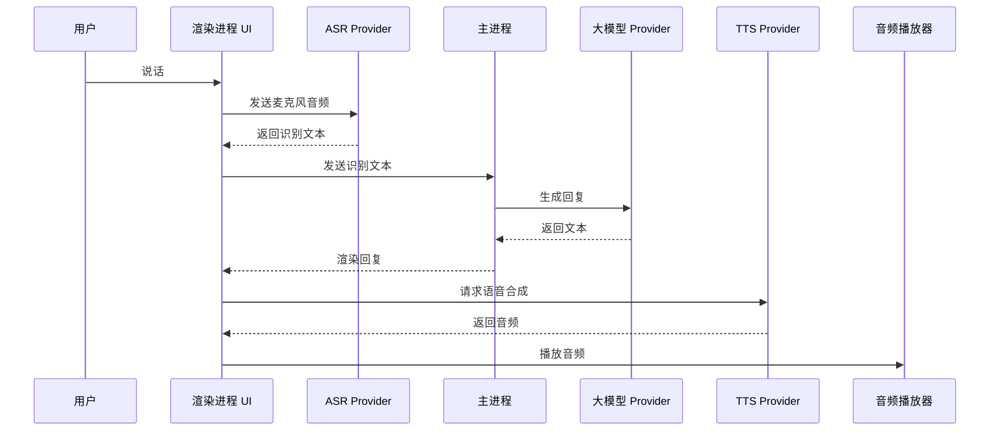
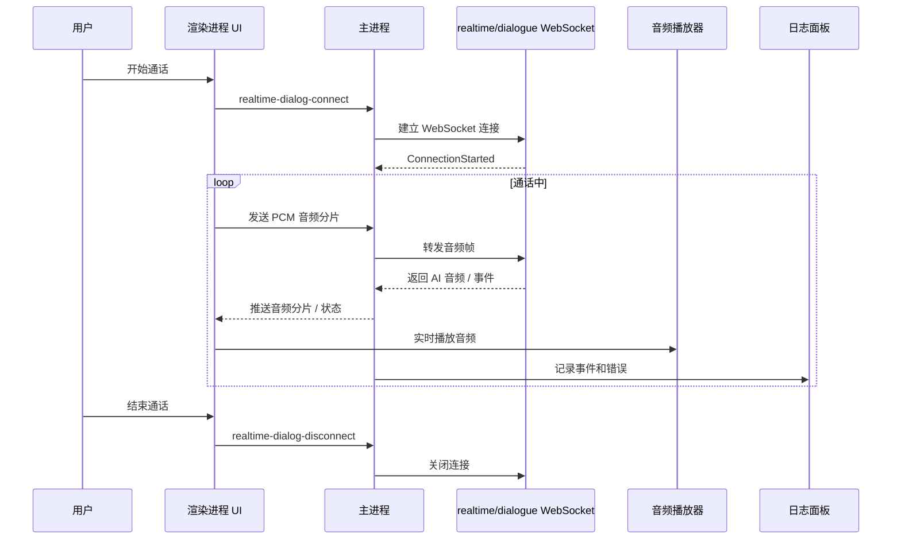
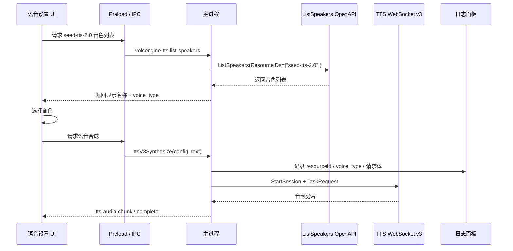

# Nova 桌面 AI Agent 工作台

Nova 是一个基于 **Electron + React + TypeScript** 的桌面 AI Agent 工作台。项目目标不是做一个普通聊天窗口，而是把文本对话、语音输入、语音合成、端到端实时语音通话、本地记忆、RAG、工具调用和可观测日志整合到一个真实可运行的桌面应用里。

这个项目用于展示应用层 AI 工程能力：如何把多个 AI 服务、安全边界、本地存储、WebSocket 音频流和桌面端交互组织成一个可维护系统。

## 项目亮点

- **桌面端架构**：Electron Main / Preload / Renderer 三层隔离，敏感能力放在主进程。
- **多模型接入**：支持豆包、小米 MiMo 和 OpenAI-compatible Provider。
- **普通语音链路**：支持 ASR -> LLM -> TTS 的半双工语音对话。
- **端到端实时语音**：接入豆包 `realtime/dialogue` WebSocket API，实现实时语音通话体验。
- **豆包 TTS 2.0**：支持 WebSocket v3 合成、动态 `ListSpeakers` 音色列表、请求参数日志。
- **小米 MiMo 语音**：支持 MiMo ASR / TTS，形成另一套语音 Provider。
- **本地能力**：SQLite 聊天存档、长期记忆、RAG、文件/剪贴板/网页等工具能力。
- **可观测性**：logger 面板记录模型请求、TTS 参数、工具调用、错误和状态流转。

## 可展示场景

当前阶段适合演示这些场景：

1. 文本对话：多模型聊天、上下文保存、日志观察。
2. 普通语音：用户说话 -> ASR 识别 -> LLM 回复 -> TTS 播放。
3. 实时通话：点击电话按钮，和端到端实时语音模型进行语音交流。
4. 豆包 TTS 音色：从官方 `seed-tts-2.0` 音色列表选择声音并合成。
5. 调试链路：在 logger 中查看 TTS 请求体、`voice_type`、`resourceId`、模型和错误原因。

## 系统架构



## 关键链路

### 1. 普通文本对话



### 2. 半双工语音对话



### 3. 端到端实时语音通话



### 4. 豆包 TTS 2.0 音色链路



## Electron 安全边界

Nova 使用 Electron 的三层隔离模型：

```text
Renderer = React UI, low privilege
Preload  = 白名单桥接层，暴露 window.electronAPI
Main     = 本地后端，处理密钥、文件、数据库、WebSocket 和外部 API
```

Renderer 不直接访问 Node.js、`.env`、SQLite、文件系统或系统命令。它只能调用 Preload 暴露的白名单接口，例如：

```ts
window.electronAPI.ttsV3Synthesize(...)
window.electronAPI.realtimeDialogConnect(...)
window.electronAPI.volcengineTTSListSpeakers(...)
```

Main Process 再通过 `ipcMain.handle(...)` 注册对应能力。这样即使 Renderer 层出现 XSS 或第三方库风险，也不能直接读取本地密钥或执行任意系统操作。

## 技术栈

| 模块 | 技术 |
| --- | --- |
| 桌面端 | Electron |
| 前端 | React, TypeScript, CSS Modules |
| 构建 | Vite |
| 本地存储 | SQLite, localStorage |
| 语音 | 豆包 ASR/TTS、豆包实时语音、小米 MiMo ASR/TTS |
| 大模型 | 豆包、MiMo、OpenAI-compatible providers |
| 音频传输 | WebSocket、PCM 分片、流式音频播放 |
| 可观测性 | 自研 logger 面板 |
| 文档 / RAG | PDF / Word / Excel / Markdown / text 解析，本地知识库 |

## 项目结构

```text
src/
  main/
    index.ts                         # Electron 主进程和 IPC handler
    services/
      realtimeDialogService.ts        # 豆包实时语音 WebSocket
      volcengineTTSVoiceCatalogService.ts
      tts/volcengineTTSWebSocketService.ts
      asr/volcengineASRWebSocketService.ts
    tools/                            # 本地工具：文件、网页、剪贴板、应用启动

  preload/
    preload.ts                        # contextBridge 白名单 API

  renderer/
    App.tsx
    components/
      Settings/                       # 语音 / 模型设置
      chat/                           # 聊天界面
      Observability/                  # 日志 / trace 面板
      Knowledge/                      # 知识库界面
      Memory/                         # 记忆界面
    core/
      model/                          # 模型 Provider
      asr/                            # ASR 管理器和 Provider
      tts/                            # TTS 管理器和 Provider
      realtimeCall/                   # 实时语音通话模式
      voiceChat/                      # 半双工语音模式
```

## 本地启动

```bash
npm install
copy .env.example .env
npm run electron:dev
```

构建检查：

```bash
npm run build
npm run build:node
```

## 环境变量

从 `.env.example` 复制 `.env`，按需填写要使用的服务。

```env
# 大模型 Provider
VITE_DOUBAO_API_KEY=
VITE_DOUBAO_MODEL=
VITE_MIMO_BASE_URL=
VITE_MIMO_API_KEY=
VITE_MIMO_MODEL=

# 豆包语音合成运行时
VITE_VOLCENGINE_APP_ID=
VITE_VOLCENGINE_ACCESS_TOKEN=

# 豆包端到端实时语音
VITE_REALTIME_DIALOG_APP_ID=
VITE_REALTIME_DIALOG_ACCESS_KEY=

# 豆包 ListSpeakers 音色目录
VOLCENGINE_ACCESS_KEY_ID=
VOLCENGINE_SECRET_ACCESS_KEY=
VOLCENGINE_REGION=cn-beijing
```

语音合成运行时使用 `VITE_VOLCENGINE_APP_ID + VITE_VOLCENGINE_ACCESS_TOKEN`。音色目录使用 `VOLCENGINE_ACCESS_KEY_ID + VOLCENGINE_SECRET_ACCESS_KEY`，因为 `ListSpeakers` 属于 OpenAPI 管理接口。

## 关键技术决策

### 为什么选择 Electron？

Nova 需要复杂 React UI、本地存储、WebSocket 音频流、桌面端能力、本地文件和调试面板。Electron 能复用成熟 Web 生态，同时通过主进程承载本地服务。

### 为什么使用 Preload，而不是让前端直接访问 Node？

Renderer 被当成低权限浏览器页面处理。密钥、文件、数据库、WebSocket 等敏感能力都经过 `window.electronAPI` 白名单方法转发，由主进程统一执行。

### 为什么同时保留 ASR-LLM-TTS 和实时语音？

两条链路解决的问题不同：

- `ASR -> LLM -> TTS` 更容易接入工具、RAG 和记忆。
- `realtime/dialogue` 更适合展示低延迟、自然的端到端语音通话。

Nova 同时保留两条路径，既能支持工具型语音工作流，也能演示实时通话体验。

### 为什么要动态拉豆包音色列表？

豆包 TTS 2.0 要求 `voice_type` 和 `resourceId=seed-tts-2.0` 匹配。Nova 通过 `ListSpeakers` 获取官方音色列表，避免手写音色 ID 导致资源不匹配。

## 面试讲解重点

- 基于 Electron 进程隔离设计桌面 AI Agent 工作台。
- 使用 Preload 白名单 API 构建安全 IPC 边界。
- 集成多个 AI Provider，并把模型、ASR、TTS、实时语音分层管理。
- 使用 WebSocket 实现 TTS 流式音频和端到端实时语音通话。
- 通过官方 `ListSpeakers` 解决豆包 TTS 2.0 音色和资源包匹配问题。
- 使用 logger 记录请求参数、状态流转和服务错误，提升调试能力。
- 把 AI 能力组织成真实产品链路，而不是孤立 API Demo。

## 当前限制

- 实时语音模式目前主要用于对话，还没有完整接入工具执行。
- 实时通话链路暂不支持会话中热切换音色。
- 工具、RAG、记忆在普通聊天链路中更完整，在实时语音链路中仍需继续接入。
- 演示稳定性依赖外部服务凭证和网络状态。

## 后续规划

- 补充项目截图。
- 增加常用音色推荐和试听。
- 优化实时通话状态展示：监听中、思考中、说话中、被打断。
- 把实时语音模式接入部分 Nova 工具和记忆。
- 增加语音和工具调用相关的评估用例。
