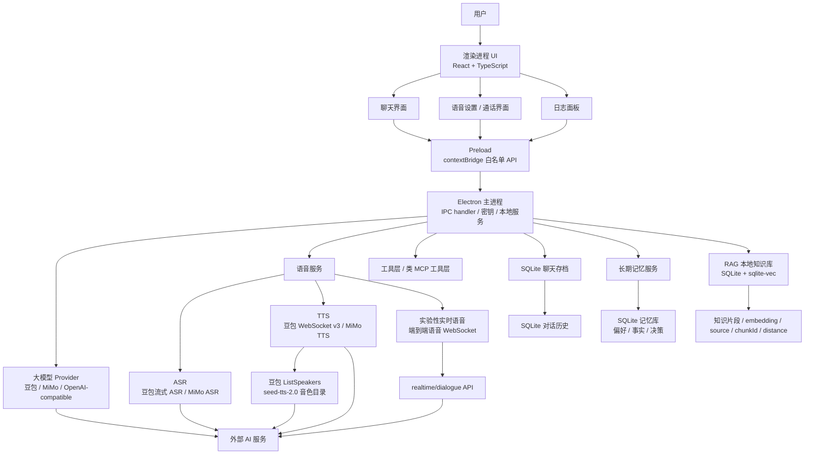
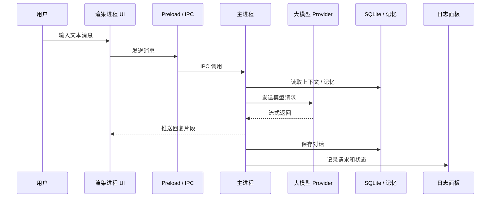
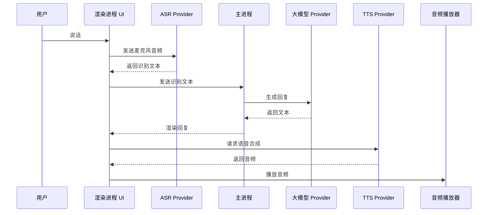
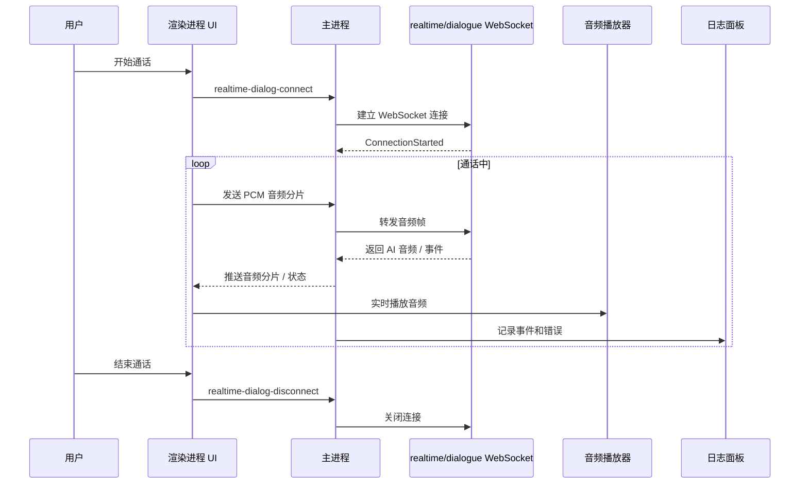
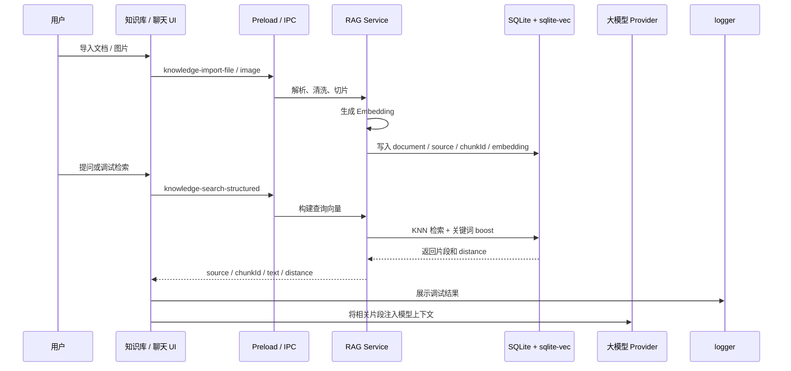
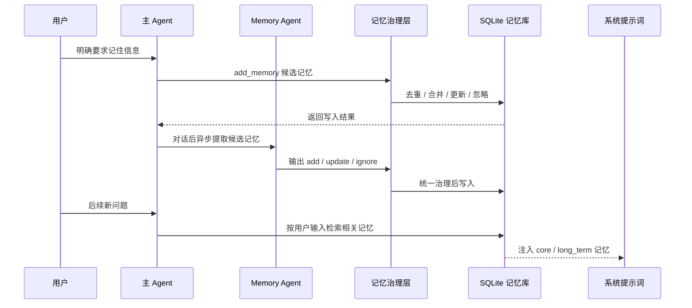
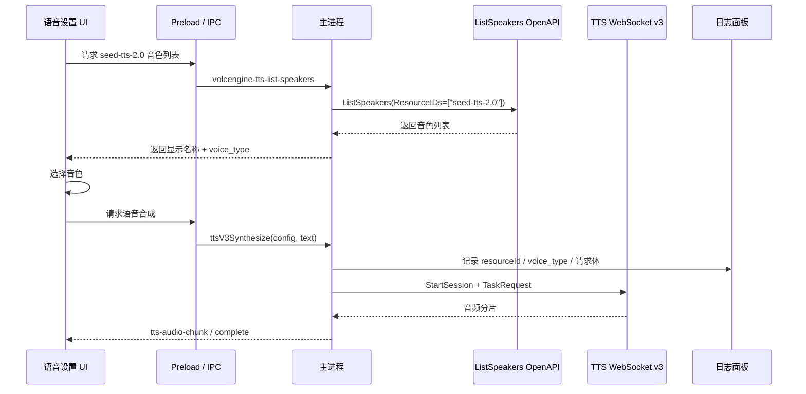

# Nova 桌面 AI Agent 工作台

Nova 是一个基于 **Electron + React + TypeScript** 的桌面 AI Agent 工作台。项目目标不是做一个普通聊天窗口，而是把多模型对话、Agent 工具调用、本地 RAG 知识库、长期记忆、语音交互和可观测日志整合到一个真实可运行的桌面应用里。

这个项目用于展示应用层 AI 工程能力：如何把多个 AI 服务、Electron 安全边界、本地存储、上下文治理、知识检索、记忆系统和桌面端交互组织成一个可维护系统。

## 项目亮点

- **桌面端架构**：Electron Main / Preload / Renderer 三层隔离，敏感能力放在主进程。
- **多模型接入**：支持豆包、小米 MiMo 和 OpenAI-compatible Provider。
- **Agent 工具调用**：统一管理文件、网页、剪贴板、知识库、记忆等本地工具能力。
- **本地 RAG 知识库**：支持多类型文件导入、文本解析、清洗切片、Embedding 向量化、SQLite + sqlite-vec 检索。
- **RAG 调试面板**：展示 Query、命中片段、source、chunkId、distance、片段正文和原始返回 JSON。
- **长期记忆系统**：支持显式记忆、自动提取、去重合并、状态管理和按需注入。
- **语音交互**：支持 ASR -> LLM -> TTS 的半双工语音对话，实时语音通话作为实验性能力保留。
- **可观测性**：logger 分层记录模型请求、工具调用、RAG 检索、记忆写入、语音链路和错误状态。

## 可展示场景

当前阶段适合演示这些场景：

1. 文本对话：多模型聊天、上下文保存、日志观察。
2. Agent 工具：让模型调用文件、网页、剪贴板、知识库和记忆工具完成任务。
3. RAG 知识库：导入 PDF / Word / Excel / Markdown / 图片等文件，检索相关片段并注入回答。
4. RAG 调试：查看检索命中的片段、来源、chunkId、distance 和原始返回结构。
5. 长期记忆：保存用户偏好、事实和决策，在后续对话中按需召回。
6. 语音交互：用户说话 -> ASR 识别 -> LLM 回复 -> TTS 播放。

## 系统架构



## 关键链路

### 1. 普通文本对话



### 2. 半双工语音对话



### 3. 实验性端到端实时语音通话



### 4. RAG 知识库检索链路



### 5. 长期记忆链路



### 6. 豆包 TTS 2.0 音色链路



## Electron 安全边界

Nova 使用 Electron 的三层隔离模型：

```text
Renderer = React UI, low privilege
Preload  = 白名单桥接层，暴露 window.electronAPI
Main     = 本地后端，处理密钥、文件、数据库、WebSocket 和外部 API
```

Renderer 不直接访问 Node.js、`.env`、SQLite、文件系统或系统命令。它只能调用 Preload 暴露的白名单接口，例如：

```ts
window.electronAPI.ttsV3Synthesize(...)
window.electronAPI.knowledgeSearchStructured(...)
window.electronAPI.memoryAddMemory(...)
```

Main Process 再通过 `ipcMain.handle(...)` 注册对应能力。这样即使 Renderer 层出现 XSS 或第三方库风险，也不能直接读取本地密钥或执行任意系统操作。

## 技术栈

| 模块 | 技术 |
| --- | --- |
| 桌面端 | Electron |
| 前端 | React, TypeScript, CSS Modules |
| 构建 | Vite |
| 本地存储 | SQLite, localStorage |
| 大模型 | 豆包、MiMo、OpenAI-compatible providers |
| Agent 工具 | Function Calling、本地文件、网页、剪贴板、知识库、记忆 |
| RAG | 文档解析、文本清洗、切片、Embedding、SQLite + sqlite-vec |
| 记忆 | SQLite、FTS、显式记忆、自动提取、去重合并、按需注入 |
| 语音 | 豆包 ASR/TTS、小米 MiMo ASR/TTS、实验性实时语音 |
| 音频传输 | WebSocket、PCM 分片、流式音频播放 |
| 可观测性 | 自研 logger 面板 |
| 文档导入 | PDF / Word / Excel / Markdown / Text / 图片识别 |

## 项目结构

```text
src/
  main/
    index.ts                         # Electron 主进程和 IPC handler
    services/
      ragService.ts                   # RAG 知识库：sqlite-vec 检索
      memoryServiceBackend.ts         # 长期记忆：SQLite / FTS / 去重
      documentParser.ts               # 文档解析、清洗和切片
      realtimeDialogService.ts        # 豆包实时语音 WebSocket
      volcengineTTSVoiceCatalogService.ts
      tts/volcengineTTSWebSocketService.ts
      asr/volcengineASRWebSocketService.ts
    tools/                            # 本地工具：文件、网页、剪贴板、应用启动

  preload/
    preload.ts                        # contextBridge 白名单 API

  renderer/
    App.tsx
    components/
      Settings/                       # 语音 / 模型设置
      chat/                           # 聊天界面
      Observability/                  # 日志 / trace 面板
      Knowledge/                      # 知识库界面
      Memory/                         # 记忆界面
    core/
      model/                          # 模型 Provider
      agent/                          # Agent 循环和工具调用
      context/                        # 上下文压缩和清洗
      memory/                         # Memory Agent / Policy / Writer
      asr/                            # ASR 管理器和 Provider
      tts/                            # TTS 管理器和 Provider
      realtimeCall/                   # 实时语音通话模式
      voiceChat/                      # 半双工语音模式
```

## 本地启动

```bash
npm install
copy .env.example .env
npm run electron:dev
```

构建检查：

```bash
npm run build
npm run build:node
```

## 环境变量

从 `.env.example` 复制 `.env`，按需填写要使用的服务。

```env
# 大模型 Provider
VITE_DOUBAO_API_KEY=
VITE_DOUBAO_MODEL=
VITE_MIMO_BASE_URL=
VITE_MIMO_API_KEY=
VITE_MIMO_MODEL=

# 豆包语音合成运行时
VITE_VOLCENGINE_APP_ID=
VITE_VOLCENGINE_ACCESS_TOKEN=

# 豆包端到端实时语音（实验性）
VITE_REALTIME_DIALOG_APP_ID=
VITE_REALTIME_DIALOG_ACCESS_KEY=

# 豆包 ListSpeakers 音色目录
VOLCENGINE_ACCESS_KEY_ID=
VOLCENGINE_SECRET_ACCESS_KEY=
VOLCENGINE_REGION=cn-beijing
```

语音合成运行时使用 `VITE_VOLCENGINE_APP_ID + VITE_VOLCENGINE_ACCESS_TOKEN`。音色目录使用 `VOLCENGINE_ACCESS_KEY_ID + VOLCENGINE_SECRET_ACCESS_KEY`，因为 `ListSpeakers` 属于 OpenAPI 管理接口。

## 关键技术决策

### 为什么选择 Electron？

Nova 需要复杂 React UI、本地存储、WebSocket 音频流、桌面端能力、本地文件和调试面板。Electron 能复用成熟 Web 生态，同时通过主进程承载本地服务。

### 为什么使用 Preload，而不是让前端直接访问 Node？

Renderer 被当成低权限浏览器页面处理。密钥、文件、数据库、WebSocket 等敏感能力都经过 `window.electronAPI` 白名单方法转发，由主进程统一执行。

### 为什么把 RAG 和记忆放在本地？

Nova 的目标是桌面端 AI Agent 工作台，知识库和长期记忆都需要可控、可调试、可持久化。本地 RAG 使用 SQLite + sqlite-vec 保存知识片段、向量、来源和 chunkId；长期记忆使用 SQLite / FTS 保存偏好、事实和决策。这样可以在本地观察数据、排查检索命中，并减少对第三方平台状态的依赖。

### 为什么要做 RAG 调试面板？

RAG 的核心问题不是“能不能搜索”，而是“模型到底拿到了哪些片段”。调试面板展示 Query、命中片段、source、chunkId、distance、片段正文和原始 JSON，便于判断切片是否合理、检索是否命中、相似度排序是否异常。

### 为什么同时保留 ASR-LLM-TTS 和实时语音？

两条链路解决的问题不同：

- `ASR -> LLM -> TTS` 更容易接入工具、RAG 和记忆。
- `realtime/dialogue` 更适合验证低延迟、自然的端到端语音通话，但对工具、RAG 和记忆的可控性较弱。

因此 Nova 以普通语音链路作为主线，实时语音通话保留为实验性验证能力。

### 为什么要动态拉豆包音色列表？

豆包 TTS 2.0 要求 `voice_type` 和 `resourceId=seed-tts-2.0` 匹配。Nova 通过 `ListSpeakers` 获取官方音色列表，避免手写音色 ID 导致资源不匹配。

## 面试讲解重点

- 基于 Electron 进程隔离设计桌面 AI Agent 工作台。
- 使用 Preload 白名单 API 构建安全 IPC 边界。
- 统一封装豆包、小米 MiMo 和 OpenAI-compatible Provider。
- 设计 Agent 工具调用系统，把文件、网页、剪贴板、知识库、记忆等能力交给模型调用。
- 基于 SQLite + sqlite-vec 实现本地 RAG 知识库，完成解析、清洗、切片、向量化和语义检索。
- 开发 RAG 调试面板，观察命中片段、来源、chunkId、distance 和原始返回结构。
- 实现长期记忆系统，支持显式记忆、自动提取、去重合并、状态管理和上下文注入。
- 使用 logger 记录模型请求、工具调用、RAG 检索、记忆写入和服务错误，提升调试能力。
- 把 AI 能力组织成真实产品链路，而不是孤立 API Demo。

## 当前限制

- 实时语音模式目前主要用于实验性对话验证，还没有完整接入工具、RAG 和记忆。
- 知识库导入质量依赖文档解析效果，扫描版 PDF 和复杂表格仍需继续增强。
- RAG 当前以本地向量检索和关键词 boost 为主，还没有加入复杂 rerank。
- 长期记忆已经具备治理链路，但记忆提取策略仍需要更多真实对话验证。
- 演示稳定性依赖外部服务凭证和网络状态。

## 后续规划

- 补充项目截图。
- 优化 RAG 调试面板，增加片段预览、来源筛选和命中解释。
- 增加知识库导入质量检查和失败原因提示。
- 优化长期记忆提取策略和记忆命中解释。
- 增加 RAG、记忆和工具调用相关的评估用例。
